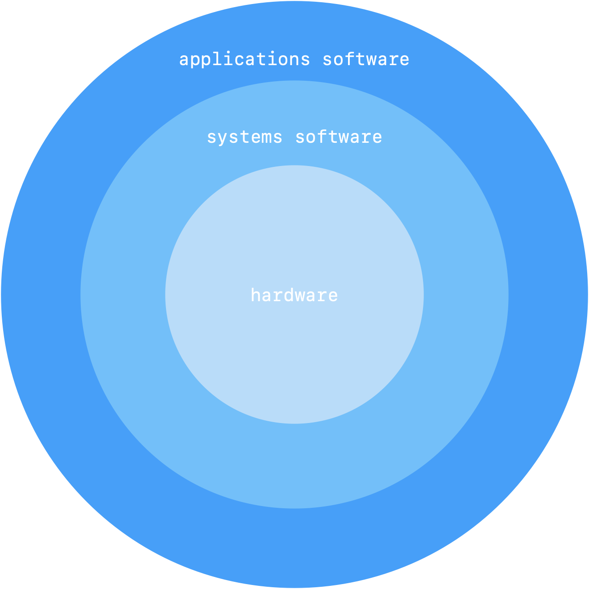

#  01 computer abstraction and technology

1.  [introduction](#introduction)
2.  [eight great ideas in computer architecture](#eight-great-ideas-in-computer-architecture)
3.  [below your program](#below-your-program)
4.  [under the covers](#under-the-covers)
5.  [technology for building processors and memory](#technologies-for-building-processors-and-memory)
6.  [performance](#performance)
7.  [the power wall](#the-power-wall)
8.  [the switch from uniprocessors to muliprocessors](#the-switch-from-uniprocessors-to-multiprocessors)
9.  [benchmarking the intel core i7](#benchmarking-the-intel-core-i7)
10. [fallacies and pitfalls](#fallacies-and-pitfalls)
11. [concluding remarks](#concluding-remarks)
12. [historical perspective and further reading](#historical-perspective-and-further-reading)

##  introduction

computers have led to a third revolution for civilization, with the information revolution taking its place alongside the agricultural and the industrial revolutions.  each time the cost of computing proves by another factor of 10 as the computer revolution continues, the opportunities for computers multiply.  applications that were economically infeasible suddenly become practical.

**computers in automobiles**  computers reduce pollution, improve fuel efficiency via engine control, and increase safety through blind spot warnings, lane departure warnings, moving object detection, and air bag inflation to protect occupants in a crash.

**cell phones**  half of the planet has mobile phones, allowing person to person communication all across the world.

**human genome project**  computer equipment to map and analyze human dna sequences.  

**world wide web**  the web has replaced libraries and newspapers

**search engines**  as the content of web grew in size and in value, finding relevant information becauses increasingly important.  today, many people rely on search engines for such a large part of their lives that would be a hardship to go without them.

hardware advances have allowed programmers to create wonderfully useful software, which explains why computers are omnipresent.  

###  classes of computing applications and their characteristics

computers are used in three different classes of applications.  

**personal computers** are possibly the best form of computing.  personal computer emphasize delivery of good performance to single users at a low cast and usually execute third-party software.  

**servers** are the modern form of what were once much larger computers, and are usually accessed only via a network.  servers are oriented to carrying large workloads, which may consist of either single complex applications - usually a scientific or engineering application - or handling many small jobs, such as would occur in building a large web server.  these applications are usually based on software from another source such as a database or simulation system, but are often modified or customized for a particular function.  servers are built from the same basic technology as desktop computers, but provide for greater computing, storage, and input/output capacity.  in general, servers also place a greater emphasis on dependability, since a crash is usually more costly than it would be on a single pc.

**supercomputers** consist of tens of thousands of processors and many **terabytes** of memory, and cost tens of hundreds of millions of dollars.  supercomputers are usually used for high end scientific and engineering calculations.  

**embedded computers** are the largest class of computers and span the widest range of applications and performance.  embedded computers include the microprocessors found in your car, in a tv set, and the network of processors that control a modern airplane or cargo ship.  embedded computing system are designed to run one application or one set of related applications that are normally integrated with the hardware and delivered as a single system.


**the full range of decimal and binary values and names for memory sizes**

|  decimal term |  abbreviation  | value      | binary term | abbreviation | value        | % larger |
|:--------------|:---------------|:-----------|:------------|:-------------|:-------------:|:-------:|
| kilobyte      |  kb            | $10^{3 }$  | kibibyte    | kib          |   $2^{10}$   |  2%      |
| megabyte      |  mb            | $10^{6 }$  | mebibyte    | mib          |   $2^{20}$   |  5%      |
| gigabyte      |  gb            | $10^{9 }$  | gibibyte    | gib          |   $2^{30}$   |  7%      |
| terabyte      |  tb            | $10^{12}$  | tebibyte    | tib          |   $2^{40}$   |  10%     |
| petabyte      |  pb            | $10^{15}$  | pebibyte    | pib          |   $2^{50}$   |  13%     |
| exabyte       |  eb            | $10^{18}$  | exbibyte    | eib          |   $2^{60}$   |  15%     |
| zettabyte     |  zb            | $10^{21}$  | zebibyte    | zib          |   $2^{70}$   |  18%     |
| yottabyte     |  yb            | $10^{24}$  | yobibyte    | yib          |   $2^{80}$   |  21%     |

embedded applications often have unique application requirements that combine a minimum performance with stringent limitations on cost or power.  for example a music player:  the processor need only be as fast as necessary to handle its limited functions, and beyond that, minimizing cost and power are the most important objectives.  embedded computers often have lower tolerance for failure, since the results can vary from upsetting to devastating.  in large embedded systems, techniques of redundancy from the server world are often employed.  

###  postpc era

replacing the pc is the **personal mobile device (pmd)**.  pmd's are battery operated with wireless connectivity to the internet and typically cost hundreds of dollars, and like pc's, users can download software to run on them.  they no longer have a keyboard and mouse and are more likely to reply on a touch sensitive screen or speech input.  

taking over from the traditional server is **cloud computing** which relies upon giant datacenters that are now known as warehouse scale computers (wscs).  companies link amazon and google build these warehouse scale computers containing 100,000 servers and then let companies rent portions of them so they can provide software services to pmds without having to build wscs of their own.  **software as a service (saas)** deployed via the cloud is revolutionizing the software industry just as pmds and wscs are revolutionizing the hardware industry.  today's software developers will often have a portion of their application taht runs on the pmd and a portion of that runs in the cloud.

###  what you can learn

programmers often follow a simple credo:  minimize memory space to make programs fast.  programmers interested in performance now need to understand the issues that have replaced the simple memory model of the 1960s:  the parallel nature of processors and the hierarchical nature of memories.  programmers need to worry about energy efficiency of their programs running either on the pmd or in the cloud, which also requires understanding what is below your code. 

concepts that will be explained in the form of the following questions:

-  how are programs written in a high level language, such as c or java translated into the language of the hardware and how does the hardware execute the resulting program? the basis of understanding the aspects of both the hardware and software that affect program performance.
-  what is the interface between the software and hardware and how does software instruct the hardware to perform needed functions?  these concepts are vital to understanding how to write many kinds of software.
-  what determines the performance of a program, and how can a programmer improve performance?  this depends on the original program, the software translation of that program into the computer's language, and the effectiveness of hardware in executing the program.
-  what techniques can be used by hardware designers to improve performance>  
-  what techniques can be used by hardware designers to improve energy efficiency?
-  what are the reasons for and the consequences of the recent switch from sequential processing to parallel processing.  this requires a description of the current hardware mechanisms to support parallelism, and the generation of **multicore microprocessors**
-  what great ideas did computer architectures come up with that lay the foundation of modern computing?

the performance of a program depends on a combination of the effectiveness of the algorithms used in the program, the software systems used to create and translate the program into machine instructions, and teh effectiveness of the computer in executing those instructions, which may include input/output operations.

**how the hardware and software affect performance**

|  hardware or software component |  how this component affects performance           |
|:--------------------------------|:--------------------------------------------------|
| algorithm                       | determines both the number of source level statements <br> and the number of i/o operations executed |
| programming language, compiler, and architecture | determines the number of computer instructions for each source level statement |
| processor and memory system     | determines how fast instructions can be executed  |
| i/o system                      | determines how fast i/o operations may be executed|

you can improve the performance of a program by leveraging the following techniques:

-  data level parallelism
-  instruction level parallelism
-  memory hierarchy optimization
-  thread level parallelism

##  eight great ideas in computer architecture

1.  design for moore's law
2.  use abstraction to simplify design
3.  make the common case fast
4.  performance via parallelism
5.  performance via pipelining
6.  performance via prediction
7.  hierarchy of memories
8.  dependability via redundancy

###  below your program

a typical application such as a word processor or a large database system may consist of millions of lines of code and rely on sophisticated software libraries that implement complex functions in support of the application.  the hardware in a computer can only execute extremely simple low level instructions.  to go from a complex application to the simple instructions involves several layers of software that interpret or translate high level operations into simple computer instructions, an example of the great idea of abstraction.

<p align=center>simplified view of hardware and software as hierarchical layers</p>

<p align=center>
    
</p>

applications are being the outermost ring and a variety of **systems software** sitting between the hardware and applications software.  these are many types of system software, but two types of system software are central to every computer system today:  an operating system and a compiler.  an **operating system** interfaces between a user's program and the hardware and provides a variety of services and supervisory function.  among the most important functions are handling basic input and output operations, allocating storage and memory, and providing for protected sharing of the computer among multiple applications using it simultaneously.  examples of operating systems used today are linux, ios, and windows.

**compilers** perform another vital function - the translation of a program written in a high-level language, such as c, c++, java, or visual basic into instructions that the hardware can execute.  given the sophistication of modern programming languages and the simplicity of the instructions executed by the hardware, the translation from a high-level program to hardware instructions is complex.  

###  from a high-level language to the language of hardware

electronic hardware are needed to send electrical signals in the form of binary numbers or bits.  computers are slaves to our commands which are instructions.  instructions, which are just collections of bits that the computer understands and obeys, can be thought of as numbers.  for example the bits,

`1000110010100000`

tell one computer to add two numbers.  numbers are used for both instructions and data is a foundation of computing.  the first programmers communicated to computers in binary numbers, but this was so tedious that they quickly invented new notions that were closer to the way humans think.  using the computer to help program the computer, the pioneers invented programs to translate from symbolic notation to binary.  the first of these programs was namely an **assembler**.  this program translates a symbolic version of an instruction into the binary version.  for example, the program would write,

`add A, B`

and the assembler would translate this notation into

`1000110010100000`

this instruction tells the computer to add the two numbers `A` and `B`.  the name coined for this symbolic language, still used today, is **assembly language**.  in contrast, the binary language that the machine understands is the **machine language**.

programmers owe their productivity - and their sanity - to the creation of **high-level programming languages** and compilers that translate programs in such languages into instructions.  the code below shows the relationship among these programs and languages, which are more examples of the power of **abstraction**.

```c
// high-level language program in c
swap(int v[], int k) {
    int temp;
    temp = v[k];
    v[k] = v[k + 1];
    v[k + 1] = temp;
}
```
↓ compiler

```assembly_x86
#  assembly language program in x86
swap:
    multi   $2, $5, 4
    add     $2, $4, $2
    lw      $15, 0($2)
    lw      $16, 4($2)
    sw      $16, 0($2)
    sw      $15, 4($2)
    jr      $31
```

↓ assembler

```
//  binary machine language program for mips
00000000101000100000000100011000
00000000100000100001000000100001
10001101111000100000000000000000
10001110000100100000000000000100
10101110000100100000000000000000
10101101111000100000000000000100
00000011111000000000000000001000
```

a compiler enables a programmer to write this high-level language expression 

`A + B`

the compiler would compile it into this assembly language statement

`add A, B`

the assembler would translate this statement into the binary instructions that tell teh computer to add the two numbers `A` and `B`.  high-level programming languages offer several important benefits.  first they allow the programmer to think in a more natural language, using english world and algebraic notation, resulting in programs that look much more like text than like tables of cryptic symbols.  they allow programmers to be designed according to their intended use.  fortran was designed for scientific computation, cobol for business data processing, lisp for symbol manipulation, and so on.  there are also domain-specific language for even narrower groups of users, such as those interested in simulation of fluids, for example.

the second advantage of programming language is improved programmer productivity.  one of the few areas of widespread agreement in software development is that it takes less time to develop programs when they are written languages that require fewer lines to express an idea. conciseness is a clear advantage of high level languages over assembly language.

the final advantage is that programming languages allow programs ot be independent of the computer on which they were developed, since compilers and assemblers can translate high-level language programs to the binary instructions of any computer.  these three advantages are so strong that today little programming is done in assembly language.

##  under the covers

the underlying hardware in any compute performs the same basic functions:  inputting data, outputting data, processing data, and storing data.  two key components of computers are **input devices**, such as a microphone and **output devices**, such as the speaker.  input feeds the computer, and output is the result of computation sent to the user.  some devices, such as wireless networks, provide both input and output to the computer.

the five classic components of a computer are input, output, memory, datapath, and control, with the last two called the processor.

###  through the looking glass

the graphics display or also the **liquid crystal displays (lcds)** .  the lcd is not the source of light, instead it controls the transmission of light.  a typical lcd includes rod-shaped molecules in a liquid that form a twisting helix that bends light entering the display, from either a light source behind the display or less often from reflected light.  the rods straighten out when a current is applied and no longer bend the light.  since the liquid crystal material is between two screens polarized at 90 degrees, the light cannot pass through unless it is bent.  today, most lcd displays use an **active matrix** that has a tiny transistor switch at each pixel to precisely control current and make sharper images.  a red-green-blue mask associated with each dot on the display determines the intensity of the three color components in the final image; in a color active matrix lcd, there are three transistors at each point.

the image is composed of a matrix of picture elements or **pixels**, which can be represented as a matrix of bits, called a bit map.  depending on the size of the screen and the resolution, the display matrix in a typical tablet ranges in size from 1024 x 768 to 2048 x 1536.  a color display might use 8 bits for each of the three colors (red, blue, and green), for 24 bits per pixel, permitting millions of different colors to be displayed.

the computer hardware support for graphics consists mainly of a raster refresh buffer, or frame buffer, to store the bit map.  the image to be represented on screen is stored in teh frame buffer, and the bit pattern per pixel is read out to the graphics display at the refresh rate.  the figure below shows a frame buffer with a simplified design of just 4 bits per pixel.

<p>
    
</p>

###  touchscreen

while pcs also use lcd displays, the tablets and smartphones of the postpc era have replaced the keyboard and mouth with touch sensitive displays.  many tablets today use capacitive sensing.  since people are electrical conductors, if an insulator like glass is covered with a transparent conductor, touching distorts the electrostatic field of the screen, which results in a change in capacitance.  this technology can allow multiple touches simultaneously, which allows gestures that can lead to attractive user interfaces.

###  opening the box

of the five classic components of the computer i/o dominates for the apple ipad 2 tablet computer.  the list of i/o devices includes a capacitive multitouch lcd display, front facing camera, rear facing camera, microphone, headphone jack, speakers, accelerometer, gyroscope, wifi network, and bluetooth network.  the datapath, control, and memory are a tiny portion of the components.

**integrated circuits**, also known as chips drive advancing technology, shown in the figure below.  the a5 package seen in the middle contains two arm processors that operate with a clock rate of 1ghz.  the processor is the active part of the computer, following the instructions of a program to the letter.  it adds numbers, tests numbers, signals i/o device to activate, and so on.  occasionally, people call the processor the **cpu**, known as the **central processor unit**.  

the package in the figure below also includes two memory chips, each with 2 gibibits of capacity, thereby supplying 512 mib.  the **memory** is where the programs are kept when they are running; it also contains the data needed by the running programs.  the memory is built from dram chips.  dram stand for **dynamical random access memory**.  multiple drams are used together to contain the instructions and data of a program.  in contrast to sequential access memories, such as magnetic tapes, the ram portion of the term dram means that memory accesses take basically the same amount of time no matter what portion of the memory is read.


descending lower into the hardware, the figure below reveals details of the microprocessor.  the processor logically comprises two main components:  datapath and control, the respective brawn and brain of the processor.  the **datapath** performs arithmetic operations, and **control** tells the datapath, memory, and i/o devices what to do according to the wishes of the instructions of the program.  

<p align=center>
    
</p>

descending into the depths of any component of the hardware reveals insights into the computer.  inside the processor is another type of memory - **cache memory**.  **cache memory** consists of a small, fast memory that acts as a buffer for the dram memory.  the nontechnical definition of cache is a safe place for hiding things.  cache is built using a different memory technology, **static random access memory (scram)**.  **scram** is faster but less dense, and hence more expensive, than dram.  sram and dram are two layers of the memory hierarchy.

abstraction is the interface between the hardware and the lowest level software.  because of its importance, it is given a special name:  the **instruction set architecture**, or simply **architecture**, of a computer.  the instruction set architecture includes anything programmers need to know to make a binary machine language program work correctly, including instructions, i/o devices, and so on.  typically, the operating system will encapsulate the details of doing i/o, allocating memory, and other low level system functions so that application programmers do not need to worry about such details.  the combination of the basic instruction set and the operating system interface provided for application programmers is called the **application binary interface**.  computer designers distinguish architecture from an **implementation** of an architecture, an implementation is hardware that obeys the architecture abstraction.

###  a safe place for data 

thus far we have seen how to input data, compute using the data, and display data.  if we were to lose power to the computer, however, everything would be lost because the memory inside the computer is **volatile** - that is, when it loses power, it forgets.  in contrast, a dvd disk doesn't forget the movie when you turn off the power to the dvd player, and thus is a **nonvolatile memory** technology.

to distinguish between the volatile memory used to hold data and programs while they are running and this nonvolatile memory used to store data and programs between runs, the term **main memory** or **primary memory** is used for the former, and **secondary memory** for the latter.  secondary memory forms the next lower layer of the memory hierarchy.  drams have dominated main memory since 1975, but **magnetic disks** dominated secondary memory starting even earlier.  becaus eof their size and form factor, personal mobile devices use **flash memory**, a nonvolatile semiconductor memory, instead of disks.  the figure of the logic board shows the chip containing the fash memory of the ipad 2.  while slower than dram, it is much cheaper than dram in addition to being nonvolatile.  although costing more per bit than disks, it is smaller, it comes in much smaller capacities, it is more rugged, and it is more power efficient than disks.  hence, flash memory is the standard secondary memory for pmds.  alas, unlike disks and dram, flash memory bits wear out after 100,000 to 1,000,000 writes.  thus, file system must keep track of the number of writes and have a strategy to avoid wearing out storage, such as by moving popular data.  

###  communicating with other computers

computer networks interconnect whole computers, allowing computer users to extend the power of computing by including communication.  networks have become so popular that they are the backbone of current computer systems; a new personal mobile device or server without a network interface would be ridiculed.  network computers have several advantages such as communication, resource sharing, and nonlocal access.

**communication** - information is exchanged between computers at high speeds

**resource sharing** -  rather than each computer having its own i/o devices, computers on the network can share i/o devices.

**nonlocal access** - by connecting computers over long distances, users need not be near the computer they are using.

networks vary in length and performance, with teh cost of communication increasing according to both the speed of the communication and the distance that information travels.  one of the most popular type of network is ethernet.  it can be up to a kilometer long and transfer at up to 40 gigabits per second.  its length and speed make ethernet useful to connect computers on the same floor of a building; hence it is an example of what is generically called a **local area network**.  local area networks are interconnected with switches that can also provide routing services and security.  **wide area networks** cross continents and are the backbone of the internet, which supports the web.  they are typically based on optical fibers and are leased from telecommunication companies.

networks have changed the face of computing in the last 30 years, both by becoming much more ubiquitous and by making dramatic increases in performance.  in the 1970s, very few individuals has access to electronic mail, the internet and web did not exist, and physically mailing magnetic tapes was the primary way to transfer large amounts of data between two locations.  local area networks were almost nonexistent, and the few existing wide area networks had limited capacity and restricted access.

as networking technology improved, it became much cheaper and had a much higher capacity.  local area network technology offers a capacity of from 1 to 40 gigabits per second, usually sharing by at most a few computers.  optical communications technology has allowed similar growth in the capacity of wide area networks, from hundreds of kilobits to gigabits and from hundreds of computers connected to a worldwide network to millions of computers connected.  this combination of dramatic rise in development of networking combined with increases in capacity have made network technology central to the information revolution of the last 30 years.

for the last decade another innovation in networking is reshaping the way computers communicate.  wireless technology is widespread, which enabled the postpc era.  the ability to make a radio in the same low cost semiconductor technology used for memory and microprocessors enabled a significant improvement in price, leading to an explosion in development.  wireless technology is different from wire based networks, since all users in an immediate area share the airwaves.

semiconductor dram memory, flash memory, and disk storage differ significantly.  for each technology, list its volatility, approximate relative access time, and approximate relative cost compared to dram.

##  technologies for building processors and memory

processors and memory have improved at an incredible rate, because computer designers have long embraced the latest in electronic technology to try to win the race to design a better computer.  all computer professionals such be familiar with the basics of integrated circuits.

a **transistor** is simply and on/off switch controlled by electricity.  the integrated circuit (ic) combined dozens to hundreds of transistors into a single chip.  there has been a tremendous increase in the number of transistors from hundreds to millions, which describes the vlsi **very large scale integrated circuit**.  to understand how to manufacture integrated circuits, we start at the beginning.  the manufacture of chips begins with **silicon**, a substance found in sand.  because silicon does not conduct electricity well, it is called a **semiconductor**.  with a special chemical process, it is possible to add materials to silicon that allow tiny areas to transform into one of the three devices.

-  excellent conductors of electricity
-  excellent insulators from electricity
-  areas that can conduct or insulate under special conditions 

transistors fall in the last category.  a vlsi circuit, then, is just billions of combinations of conductors, insulators, and switches manufactured in a single small package.  the manufacturing process for integrated circuits is critical to the cost of the chips and hence important to computer designers.  the manufacturing process for integrated circuits is critical to the cost of the chips and hence important to computer designers.  the figure below shows that process.  the process starts with a **silicon crystal ingot**, which looks like a giant sausage.  today, ingots are 8 - 12 inches in diameter and about 12 - 24 inches long.  an ingot is finely sliced into **wafers** no more than 0.1 inches thick.  these wafers then go through a series of processing steps, during which patterns of chemicals are placed on each wafer, creating the transistors, conductors, and insulators discussed earlier.  today's integrated circuits contain only one layer of transistors byt have from two to eight levels of meta conductor, separated by layers of insulators.

<p align=center>
    
</p>

a single microscopic flow in teh water itself or in one of the dozens of patterning steps can result in that area of the wafer failing.  these **defects**, as they are called, make it virtually impossible to manufacture a perfect wafter.  the simplest way to cope with imperfection is to place many independent components on a single wafer.  the patterned wafter is then chopped up, or diced, into these components, called **dies** and more informally known as **chips**.  the figure below shows a photograph of a wafer containing microprocessors before they have been diced.

<p align=center>
    
</p>

dicing enables you to discard only those dies that were unlucky enough to contain the flows, rather than the whole wafer.  this concept is quantified by the yield of a process, which is defined as the percentage of good dies from the total number of dies on the wafer.

the cost of an integrated circuit rises quickly as the die size increases, due both to the lower yield and the smaller number of dies that fit on a wafer.  to reduce the cost, using the next generation process shrinks a large die as it uses smaller sizes for both transistors and wires.  this improves the yield and the die count per wafer.  a 32 nanometer nm process was typical in 2012, which means essentially that the smallest feature size on the die is 32 nm.

once you've found good dies, they are connected to the input/output pins of a package, using a process called bonding.  these packaged parts are tested a final time since mistakes can occur in packaging, and then they are shipped to customers.

the cost of an integrated circuit can be expressed in three simple equations

$$\text{cost per die } = \frac{\text{cost per wafer}}{\text{yield} \times \text{dies per wafer}}$$

$$\text{dies per wafer} \approx \frac{\text{wafer area}}{\text{die area}}$$

$$\text{yield } \approx \frac{1}{(1 + (\text{defects per area} \times \text{die area}/2))^{2}}$$ 

##  performance

assessing the performance of computers can be challenging.  the scale and intricacy of modern software systems, together with the wide range of performance improvements techniques employed by hardware designers, have made performance assessment much more difficult.  the following section will describe different ways in which performance can be determined, the metrics or measuring performance from the viewpoint of both a computer user and a designer.  and we also look at how these metrics are related and present the classical processor performance equation.

###  defining performance

we need to first define what we mean by performance and consider different measures of performance.  if you were running a program on two different desktop computers, you'd say that the faster one is the desktop computer that gets teh job done first.  if you were running a datacenter that had several servers running jobs submitted by many users, you'd say that the faster computer was the one that completed the most jobs during a day.  as an individual computer user, you are interested in reducing **response time** - the time between the start and completion of a task - also referred to as **execution time**.    data managers are often interested in increasing **throughput** or **bandwidth** - the total amount of work done in a given time.  hence in most cases we will need different performance metrics as well as different sets of applications to benchmark personal mobile devices, which are more focused on response time, versus servers, which are more focused on throughput.

in discussing the performance of computers, we will be primarily concerned with response time.  to maximize performance, we want to minimize response time or execution time for some task.  thus we can related performance and execution time for a computer $X$.

$$\text{performance}_{X} = \frac{1}{\text{execution time}_{X}}$$

this means that for two computer $X$ and $Y$, if the performance of $X$ is greater than the performance of $Y$, we have

$$\text{performance}_{X} > \text{performance}_{Y}$$

$$\frac{1}{\text{execution time}_{X}} > \frac{1}{\text{execution time}_{Y}}$$

$$\text{execution time}_{X} > \text{execution time}_{Y}$$

that is the execution time on $Y$ is longer than that on $X$, if $X$ is faster than $Y$.  in discussing a computer design, we often want to relate the performance of two different computers quantitatively.  we will use the prase $X$ is $n$ times faster than $Y$ or equivalently $X$ is $n$ time as fast as $Y$ to mean,

$$\frac{\text{performance}_{X}}{\text{performance}_{Y}} = n$$

if $X$ is $n$ times as fast as $Y$, then the execution time on $Y$ is $n$ times as long as it is on $X$

$$\frac{\text{performance}_{X}}{\text{performance}_{Y}} = \frac{\text{execution time}_{Y}}{\text{execution time}_{Y}} = n$$

improving performance means increasing performance, improving execution time means decreasing execution time.

###  throughput and response time

do the following changes to a computer system increase throughput, decrease response time, or both?

1.  replacing the processor in a computer with a faster version
2.  adding additional processors to a system that uses multiple processors for separate tasks

decreasing response time almost always improves throughput.  hence in case 1 both response time and throughput are improved.  in case 2, no one task gets work done faster, so only throughput is increases.  if however, the demand for processing in the second case was almost as large as the throughput, the system might force requests to queue up.  in this case increasing the throughput could also improve response time, since it would reduce the waiting time in the queue.  in many real computer systems, changing either execution time or throughput often affects the other.

###  measuring performance

time is the measure of computer performance:  the computer that performs the same amount of work in the least time is the fastest.  program execution time is measured in seconds per program.  however, time can be defined in different ways, depending on what we count.  the most straightforward definition of time is called wall clock time, response time, or elapsed time.  these terms mean the total time to complete a task, including disk access, memory accesses, input/output (i/o) activities, operating system overhead - everything.  

computers are often shared, however, and a processor may work on several programs simultaneously.  in such cases, the system may try to optimize throughput rather than attempt to minimize the elapsed time for one program.  hence, we often want to distinguish between the elapsed time and the time over which the processor is working on our behalf.  **cpu execution time** or simply **cpu time**, which recognizes this distinction, is the time the cpu spends computing for this task and does not include time spent waiting for io or running other programs.  cpu time can be further divided into the cpu time spent in the program called **user cpu time** and the cpu time spent in the operating system performing tasks on behalf of the program called **system cpu time**.  differentiating between system and user cpu tim eis difficult to do accurately, because it is often hard to assign responsibility for operating system activities to one user program father than another and because of the functionality difference among operating systems.

we will maintain a distinction between performance based on elapsed time and that based on cpu execution time.  we will use the term system performance to refer to elapsed time on an unloaded system and cpu performance to refer to user cpu time.  we will focus on cpu performance in this chapter, although our discussions of how to summarize performance can be applied to either elapsed time or cpu time measurements.

###  understanding program performance

different applications are sensitive to different aspects of the performance of a computer system.  many applications, especially those running on servers, depend as much on i/o performance, which in turn relies on both hardware and software.  total elapsed time measured by a wall clock is the measurement of interest.  in some application environments, the user may care about throughput, response time, or a complex combination of the two (e.g. maximum throughput with a worst case response time).  to improve the performance of a program, one must have a clear definition of what performance metric matters and then proceed to look for performance bottlenecks by measuring program execution and looking for the likely bottlenecks.  

computer designers may want to think about a computer by using a measure that related to how fast the hardware can perform basic functions.  almost all computers are constructed using a clock that determines when events take place in the hardware.  these discrete time intervals are called **clock cycles**, **ticks**, **clock ticks**, **clock periods**, **clocks**, or **cycles**.  designers refer to the length of a **clock period** both as the time for a complete clock cycle (e.g. 250 picoseconds, or 250 ps) and the clock rate (e.g. 4 gigahertz, or 4 ghz), which is the inverse of the clock period.  in the next subsection, we will formalize the relationship between the clock cycles of the hardware designer and the seconds of the computer user.

###  cpu performance and its factors

users and designer often examine performance using different metrics.  if we could relate these different metrics, we could determine the effect of a design change on the performance by the user.  since we are confining ourself to cpu performance at this point, the bottom line performance measure is cpu execution time.  a simple formula related the most basic metrics (clock cycles and clock cycle time) to cpu time.

$$\text{cpu execution time for a program } = \text{cpu clock cycles for a program } \times \text{clock cycle time}$$

alternatively, because clock rate and clock cycle time are inverses,

$$\text{cpu execution time for a program } = \frac{\text{cpu clock cycles for a program}}{\text{clock rate}}$$

this formula makes it clear that the hardware designer can improve performance eby reducing the number of clock cycles.  as we will see in later, the designer often faces a trade off between the number of clock cycles needed for a program and the length of each cycle.  many techniques that decrease the number of clock cycles may also increase the clock cycle time.

###  improving performance example

our favorite program runs in 10 seconds on a computer A, which has a 2 ghz clock.  we are trying to help a computer designer build a computer B, which will run this program in 6 seconds.  the designer has determined that a substantial increase in the clock rate is possible, but this increase will affect the rest of the cpu design, causing computer B to require 1.2 time as many clock cycles a computer A for this program.  what clock rate should we tell the designer to target?

lets first find teh number of clock cycles required for the program on A

$$\text{cpu time}_{A} = \frac{\text{cpu clock cycles}_{A}}{\text{clock rate}_{A}}$$

$$\text{cpu time}_{A} = 10 \text{ seconds}$$

$$\text{clock rate}_{A} = 2 \text{ ghz} = 2 \times 10^{9} \text{ cycles per second}$$

$$10 \text{ seconds} = \frac{\text{cpu clock cycles}_{A}}{2 \times 10^{9} \text{ cycles per second}}$$

$$\text{cpu clock cycles}_{A} = 10 \text{ seconds } \times 2 \times 10^{9} \text{ cycles}$$

$$\text{cpu clock cycles}_{A} = 20 \times 10^{9} \text{ cycles}$$

cpu time for B can be found using this equation 

$$\text{cpu time}_{B} = \frac{1.2 \times \text{cpu clock cycles}_{A}}{\text{cock rate}_{B}}$$

$$6 \text{ seconds } = \frac{1.2 \times 20 \times 10^{9} \text{ cycles }}{\text{clock rate}_{B}}$$

$$\text{clock rate}_{B} = \frac{1.2 \times 20 \times 10^{9} \text{ cycles }}{6 \text{ seconds }} = \frac{4 \times 10^{9} \text{ cycles }}{1 \text{ second}} = 4 \text{ ghz}$$

to run the program in 6 seconds, B must have twice the clock rate of A.

###  instruction performance

the performance equations above did not include any reference to the number of instructions needed for the program.  however, since the compiler clearly generated instructions to execute, and the computer had to execute the instructions to run the program, the execution time must depend on the number of instructions in a program.  one way to think about execution time is that it equals the number of instructions executed multiplied by the average time per instruction.  therefore, the number of clock cycles, required for a program can be written as 

cpu clock cycles = instructions for a program $\times$ average clock cycles per instruction

the term **clock cycles per instruction**, which is the average number of clock cycles each instruction takes to execute, is often abbreviated as **cpi**.  since different instructions may take different amounts of time depending on what they do, cpi is an average of all the instructions executed in the program.  cpi provides one way of comparing two different implementations of the same instruction set architecture, since the number of instructions executed for a program will, of course, be the same.

###  the classic cpu performance equation

we can now write this basic performance equation in terms of **instruction count** (the number of instructions executed by the program), cpi, and clock cycle time

$$\text{ cpu time } = \text{instruction count } \times \text{cpi} \times \text{clock cycle time}$$

or since the clock rate is the inverse of the clock cycle time

$$\text{ cpu time } = \frac{\text{instruction count } \times \text{cpi}}{\text{clock rate}}$$

these formulas are particularly useful because they separate the three key factors that affect performance.  we can use these formulas to compare two different implementations or to evaluate a design alternative if we know its impact on these three parameters.

###  comparing code segments

a compiler designer is trying to decide between two code sequences for a particular computer.  the hardware designers have supplied the following facts

**cpi for each instruction class**

| time parameter | class a | class b | class c |
|:---------------|:--------|:--------|:--------|
| cpi            | 1       | 2       | 3       |

for a particular high level language statement, the compile writer is considering two code sequences that require the following instruction counts

**instruction counts for each instruction class**

| code sequence | class a | class b | class c |
|:--------------|:--------|:--------|:--------|
| sequence 1    | 2       | 1       | 2       |
| sequence 2    | 4       | 1       | 1       |

which code sequence executes the most instructions?  which will be faster?  what is the cpi for each sequence?

sequence 1 executes 2 + 1 + 2 = 5 instructions

sequence 2 executes 4 + 1 + 1 = 6 instructions

therefore, sequence 1 executes fewer instructions.  we can use the equation for cpu clock cycles based on instruction count and cpi to find the total number of clock cycles for each sequence.

$$\text{CPU clock cycles} = \sum_{i = 1}^{n}{\text{CPI}_{i} \times \text{C}_{i}}$$

this 


