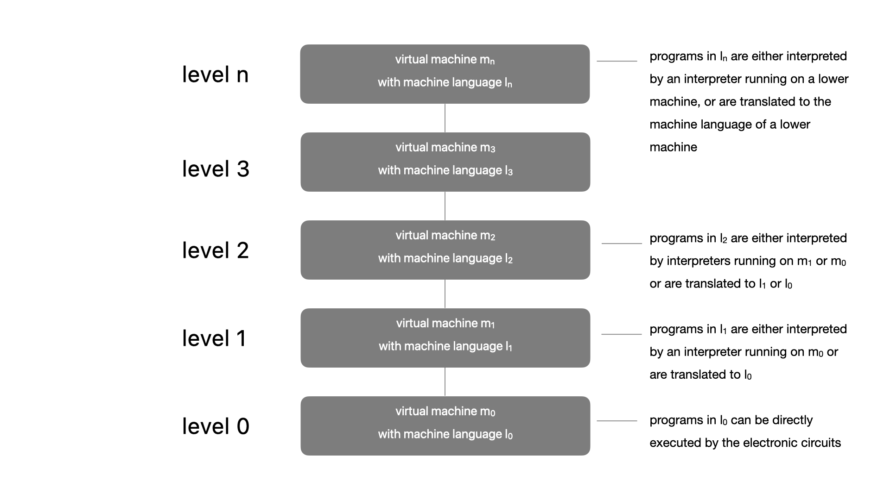

#  structured computer organization

[1  introduction](##1-introduction)

[1.1  structured computer organization](##1-1-structured-computer-organization)

[1.1.1  languages, levels, and virtual machines](##1-1-1-languages-levels-and-virtual-machines)

[1.1.2  contemporary multilevel machines](##1-1-2-contemporary-multilevel-machines)

##  1 introduction

a digital computer is a machine that can do work for people by carrying out instruction given to it.  a sequence of instructions describing how to perform a certain task is called a **program**.  the electronic circuits of each computer can recognize and directly execute a limited set of simple instructions into which all its programs must be converted before they can be executed.  these basic instructions are rarely much more complicated than,

add two numbers

check a number to see if it is zero

copy a piece of data from one part of the computer's memory to another

together, a computer's primitive instructions form a language in which people can communicate with the computer.  such a language is called **machine language**.  the people designing a new computer must decide what instructions to include in its machine language.  usually, they try to make the primitive instructions as simple as possible consistent with the computer's intended use and performance requirements, in order to reduce the complexity and cost of the electronic needed.  because most machine languages are so simple, it is difficult and tedious for people to use them.

this simple observation has, over the course of time, led to a way of structuring computers as a sequence of abstractions, each abstraction building on the one below it.  in this way, the complexity can be mastered and computer systems can be designed in a systematic, organized way.  we call this approach **structured computer organization**.  

##  1.1 structured computer organization

as mentioned above, there is a large gap between what is convenient for people and what is convenient for computers.  people want to do x, but computers can only do y.  this leads to a problem, the following section will explain how this problem is solved.

###  1.1.1 languages, levels, and virtual machines

the problem can be attached in two ways; both involve designing a new set of instructions that is more convenient for people to use than the set of built-in machine instructions.  taken together, these new instructions also form a language, which we will call l1, just as the built-in machine instructions form a language, which we will call l1.  the two approaches differ in the way programs written in l1 are executed by the computer, which, after all, can only execute programs written in its machine language, l0.

one method of executing a program written in l1 is first to replace each instruction in it by an equivalent sequence of instructions in l0.  the resulting program consists entirely of l0 instructions.  the computer then executes the new l0 program instead of the old l1 program.  this technique is called **translation**.

the other technique is to write a program in l0 that takes programs in l1 as input data and carries them out by examining each instruction in turn and executing the equivalent sequence of l0 instructions directly.  this technique does not require first generating a new program in l0.  it is called **interpretation** and the program that carries it out is called an **interpreter**.

translation and interpretation are similar.  in both methods, the computer corries out instructions in l1 by executing equivalent sequences of instructions in l0.  the difference is that, in translation, the entire l1 program is first converted to a l0 program, the l1 program is thrown away, and then the new l0 program is loaded into the computer's memory adn executed.  during execution, the newly generated l0 program is running and in control of the computer.

an interpretation, after each l1 instruction is examined and decoded, it is carried out immediately.  no translated program is generated.  here, the interpreter is in control of the computer.  to it, the l1 program is just data.  both methods, and increasingly, a combination of the two are widely used.

rather than thinking in terms of translation or interpretation, it is often simpler to imagine the existence of a hypothetical computer or **virtual machine** whose machine language is l1.  let us call this virtual machine m1.  and let us called the machine corresponding to l0, m0.  if such a machine could be constructed cheaply enough, there would be no need for having language l0 or a machine that executed program in l0 at all.  people could simply write their programs in l1 and have the computer execute them directly.  even if the virtual machine whose language is l1 is too expensive or complicated to construct out of electronic circuits, people can still write programs for it.  these programs can be either interpreted or translated by a program written in l0 that itself can be directly executed by the existing computer.  in other words, people can write programs for virtual machines, just as though they really existed.

to make translation or interpretation practical, the languages l0 and l1 must not be too different.  this constraint often means that l1, although better than l0, will still be far from ideal for most applications.  this result is perhaps discouraging in light of the original purpose for creating l1 - relieving the programmer of the burden of having to express algorithms in a language more suited to machines than people.s  however, this situation is not hopeless.

the obvious approach is to invent still another set of instructions that is more people oriented and less machine oriented than l1.  this third set also forms a language, which we will call l1 and with virtual machine m2.  people can write programs in l2 just as though a virtual machine with l2 as its machine language really existed.  such programs can be either translated to l1 or executed by an interpreter written in l1.

the invention of a whole series of languages, each one more convenient than its predecessors, can go on indefinitely until a suitable one is finally achieved.  each language uses its predecessor as a basis, so we may view a computer using this technique as a series of **layers** or **levels**, one on top of another, as shown in the figure below.  the bottommost language or level is the simplest and the topmost language or level is the most sophisticated.

there is an important relation between a language and a virtual machine.  each machine has a machine language, consisting of all the instructions that the machine can execute.  in effect, a machine defines a language.  similarly, a language defines a machine - namely, the machine that can execute all programs written ibn the language.  of course, the machine defined by a certain language may be enormously complicated adn expensive to construct directly out of electronic circuits byt we can imagine it nevertheless.  a machine with c or c++ or java as its machine language would be too complex indeed but could be built using today's technology.  there is a good reason, however, for not building such a computer -  it would not be cost effective compared to other techniques.  merely being doable is not good enough -  a practical design myst be cost effective as well.

in a certain sense, a computer with n levels can be regarded as n different virtual machines, each one with a different machine language.  we will use the terms "level" and "virtual machine" interchangeably.  however, please note that like many terms in computer science, "virtual machine" has other meanings as well.  only programs written in language l0 can be directly carried out by the electronic circuits, without the need for intervening translation or interpretation.  programs written in l1, l2, ..., ln must be either interpreted by an interpreter running on a lower level or translated to anther language corresponding to a lower level.

a person who writes programs for the level n virtual machine need not be aware of the underlying interpreters and translators.  the machine structure ensures that these programs will somehow be executed.  it is of no real interest whether they are carried out step by step by an interpreter which, in turn, is also carried out by another interpreter, or whether they are carried out by the electronic circuits directly.  the same result appears in both cases - the programs are executed.  

most programmers using an n-level machine are interested only in the top level, the one least resembling the machine language t the very bottom.  however, people interested in understanding how a computer really works must study all the levels.  people who design new computers or new levels must also be familiar with levels other than the top on.  the concepts and techniques of constructing machines as a series of levels and teh details of the levels themselves form the main subject of these notes.

