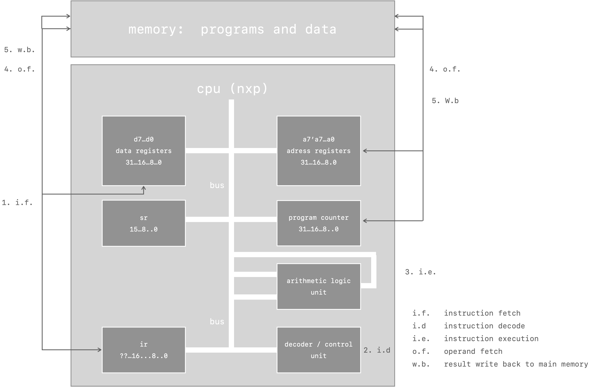

#  lecture 02

**cs 394 computer architecture**

**august 22 2024**

[computer architecture - a quick introduction](#computer-architecture---a-quick-introduction)  
[how does a simple computer work](#how-does-a-simple-computer-work)  
[introduction to computers](#introduction-to-computers)  
[eight great ideas in computer architecture](#eight-great-ideas-in-computer-architecture)  
[technologies for building processors and memory](#technologies-for-building-processors-and-memory)  

##  computer architecture - a quick introduction

computer architecture or digital computer organization - is the conceptual design and fundamental operational structure of a computer system.

1959 $\rightarrow$ imb machine organization department used architecture

1964 $\rightarrow$ imb system/30 used architecture

**von neumann architecture** - single memory for data and instructions

**harvard architecture** - separate memory for data and instructions

**programmed data processor pdp** - 1957, digital equipment corporation

**key components of a simple computer**

-  cpu (cu, alu, registers)
-  memory (main/primary memory, split or unified)
-  bus (collection of wires)
-  input/output (i/o, monitor, keyboard)
-  storage (secondary memory)

a computer system consists of programs are a set of wisely selected instructions and execution which executes the programs.  there are major steps of execute an instruction.

an example of which of the five steps are needed

1. `[mem - x] = [mem - y] + [mem - z]` - x = y + z; (all steps are needed)
2. `[reg - 1] = [reg - 2] - [reg - 3]` - 1, 2, 3 are needed
3. `[reg - 4] = [mem - a ] + 1` - 5 not needed
4. `[mem - b] = 7`
5. `go to [mem -c ]`

**computer system diagram**

