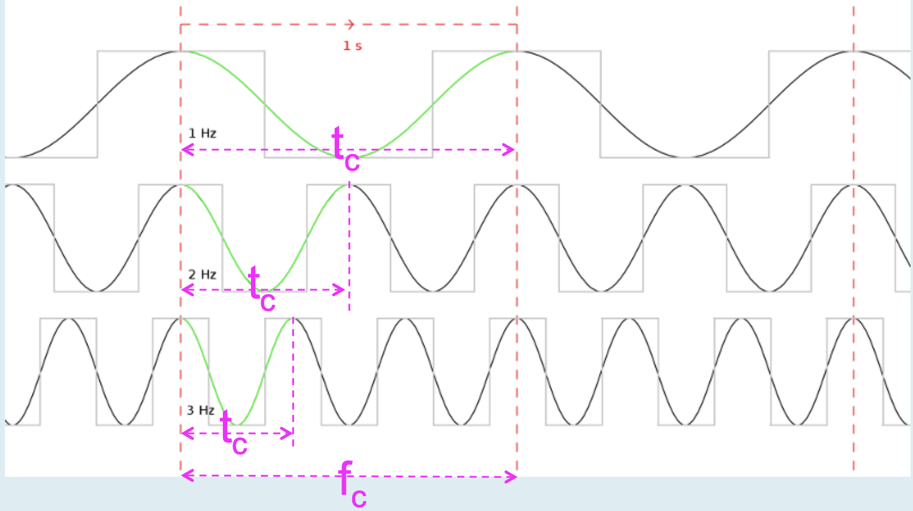
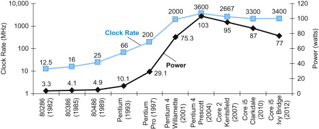
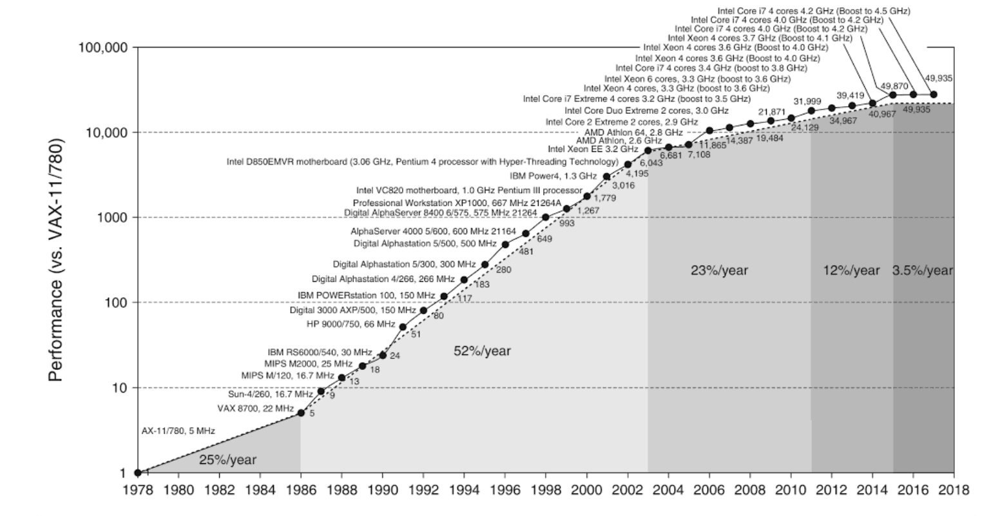
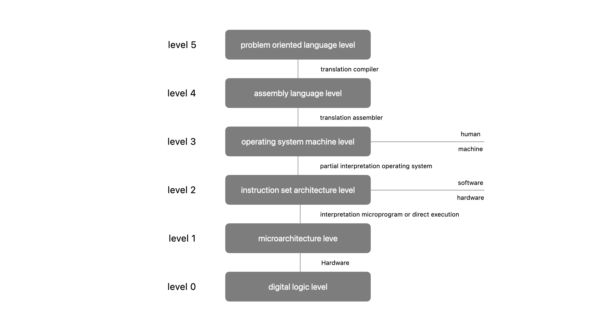

#  lecture 05

**tuesday, september 3 2024**

**cs 394 computer architecture**

##  clock cycle time and rate

relationship between clock / cycle time and clock rate

clock rate frequency > clock frequency $f_{c}$

clock rate $f_{c}$ in hertz hz **1 hz = 1 cycle / second**

clock cycle time > time for one cycle $t_{c}$

$t_{c} = 1/f_{c}$

$f_{c} = 1 / t_{c}$

clock cycle time = 1 / clock rate

clock rate = 1 / clock cycle time

    

**cpu performance and its factors**

cpu execution time for a program = cpu clock cycles for a program $\times$ clock cycle time

cpu execution time for a program = cpu clock cycles for a program / clock rate

**problem**

our favorite program runs in 10 seconds on a computer a, which has a 2 gz clock.  we are trying to help a computer designer build a computer b, which will run this program in 6 seconds.  the designer has determined that a substantial increase in the clock rate is possible, but this increase will affect the rest of the cpu design, causing computer b to require 1.2 times as many clock cycles as computer a for this program.  what clock rate should we tell the designer to target?

$\text{cpu time}_{a} = \frac{\text{cpu clock cycles}_{a}}{\text{clock rate}_{a}}$ = 

...

##  the power wall

the power wall represents a critical challenge in scaling processor performance due to the limits of power consumption and heat dissipation.

addressing this challenge involves a combination of design innovation, cooling technology, and alternative performance strategies.

    

$\text{energy } \alpha \text{ } 1/2 \times \text{capacitive load} \times \text{voltage}^2$

the power erquired per transistor is just the product of energy of a transition and the frequency of transitions

$\text{power } \alpha \text{ } 1/2 \times \text{capacitive load} \times \text{voltage}^2 \times \text{frequency switched}$

**problem** 

suppose we developed a new, simpler processor that has 85% of the capacitive load of the more complex older processor.  further, assume that it can adjust voltage so that it can reduce voltage 15% compared to processor b, which results in a 15% shrink in frequency.  what is the impact on dynamic power?

$\text{power} = 1/2 \times \text{capacitive load} \times \text{voltage}^2 \times \text{frequency}$

find power of the old and new processors, then compare

$$\frac{\text{power}_{\text{new}}}{\text{power}_{\text{old}}} = \frac{\langle \text{capacitive load} \times 0.85 \rangle \times \langle \text{voltage} \times 0.85 \rangle^2 \times \langle \text{frequency switched} \times 0.85\rangle}{\text{capacitive load} \times \text{voltage}^2 \times \text{frequency switched}}$$

$$\frac{\text{power}_{\text{new}}}{\text{power}_{\text{old}}} = \frac{\langle 100 \times 0.85 \rangle \times \langle 100 \times 0.85 \rangle^2 \times \langle 100 \times 0.85\rangle}{100 \times 100^2 \times 100}$$

$$\frac{\text{power}_{\text{new}}}{\text{power}_{\text{old}}} = \frac{\langle \cancel{100} \times 0.85 \rangle \times \langle \cancel{100} \times 0.85 \rangle^2 \times \langle \cancel{100} \times 0.85\rangle}{\cancel{100} \times \cancel{100}^2 \times \cancel{100}}$$

$$\frac{\text{power}_{\text{new}}}{\text{power}_{\text{old}}} = 0.85^4 = 0.52$$

the new processor uses about half (0.52) of the power of the old processor

##  from uniprocessors to multiprocessors

growth in processor performance in 1980 - 2018

    

1986 - 2003 - uniprocessor performance increased by 52% per year

2003 - 2011 - uniprocessor performance increased by 23% per year

2011 - 2015 - uniprocessor performance increased by 12% per year

2015 - 2018 - uniprocessor performance increased by 3.5% per year

slowing in uniprocessor performance has led to a switch to multiprocessor systems

##  the intel core i7

**about** -  the intel core i7 is a series of high performance processor designed by intel, typically targeted at enthusiasts, gamers, and professionals

**benchmark** -  a program selected for use in comparing computer performance

**spec cpu benchmark** -  a widely recognized and influential suite of tests used to evaluate and compare the performance of computer processors

**workload** -  a set of programs run on a computer that is either the actual collection of applications run by a user or constructed from real programs to approximate such a mix

##  computer a multilevel machine

different languages

natural languages

interpretation / translation

computer languages

programming languages

interpretation / translation

##  multilevel machines

a digital computer solves problems by carrying out instructions

a program is a sequence of instructions describing how to perform / solve a certain task / problem

programs are written by people using a programming language

machine language is a limited set of primitive instructions that are used by people to communicate with a computer

**problem**

we want the machine language to be very simple so as to reduce the complexity and the cost of electronics $\rightarrow$ this becomes tedious for people

we ant to make it convenient for people to use the computer $\rightarrow$ need complex electronics

**solution**

from a language level two of instructions that are more convenient to use by people than the built-in machine language level one

how can a program written in level two be executed by the computer?

translation - replace each instruction in the level two program by an equivalent sequence of instructions in level one.  the new level one program is then executed by the computer

interpretation -  a level one program examines the level two program instructions by instruction and executes the equivalent sequence of level one instructions directly

it is convenient to imagine the existence of a virtual machine with a level two machine language

level one and level two must not be too different $\rightarrow$ level two is far from ideal for most applications

invent another set of instructions that is more people oriented

call the language formed by this set level three

this can be extended to as many levels as needed so as to make it convenient for most application programmers

##  a n + 1 level machine

    

##  a six level machine

    

in the 1940s, two level computer

isa level - software

digital logic level hardware

in 1950s, three level computer

isa level - software

microarchitecture level - simplified hardware, complicated logic, design rectification, bug fix, cheap, flexible

digital logic level - hardware