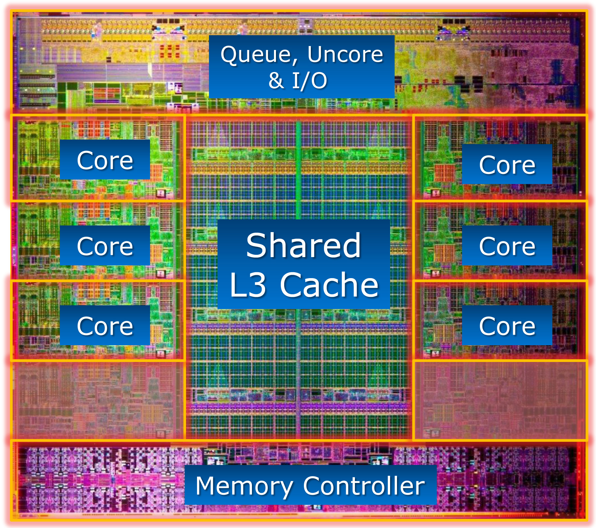

#  lecture 09

###  computer families

tanenbaum and austin book edition 5

intel pentium 4 - pc, laptop

sun microsystems sparc - scalable processor architecture - workstation, server

intel embedded cpu 8051 - embedded systems

x86 - pc, server, and more

arm - mobile, tablet, smart phone

avr - embedded systems, microcontroller, low power and invisible computer

8086 $\rightarrow$ cisi - complex instruction set architecture

arm $\rightarrow$ risi - reduced instruction set architecture

###  intel core i7-3960x die

21x21 mm, 2.27 bt

cache is a fast memory that stores copies of data from slower main memory locations

    

###  computer system with cache

cl1 -  level 1 cache or first level cache - private, split into instruction cache l1 and data cache d1

cl2 -  level 2 cache or second level cache -  shared, unified instructions and data

cl3 -  level 3 cache or third level cache

###  arm architecture

###  nvidia tegra 2 soc

###  avr architecture

###  arduino atmega 168 / 328 diagram

atmel megaavr - 168

3 hardware timers

6 pwms control light

8 atds read voltage

universal serial rcv / trans

sensor interface

watchdog timer

real time clock

others